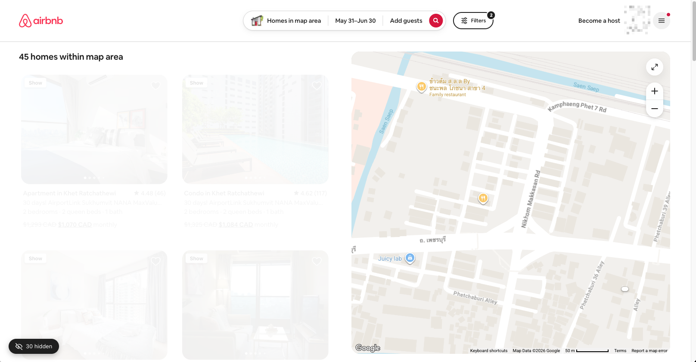

# Airbnb Listing Hider

Chrome extension that lets you hide Airbnb listings from search results. Hidden listings stay hidden across page changes, map moves, and browser sessions.

Tired of scrolling past the same listings you've already rejected? Just hide them.



## Why I Made This

Airbnb is unlikely to offer a "hide" option any time soon — they probably don't want to draw attention to bad or scam listings. Overall Airbnb is pretty good for listing quality, but every once in a while you find a group of listings all together from several hosts ("investors") that create fake listings and share the actual condos as a group. Each puts up multiple listings. They're easy to spot once you start seeing repeating photos and descriptions that all say the same thing — like charging a deposit or some specific rules. Being able to hide them cleans up your search results fast.

## Features

- **Hide/Show button** on every listing card (appears on hover)
- **Map markers hidden too** — when you hide a listing, its pin disappears from the map
- **Persistent** — hidden listings are saved locally and survive page reloads, navigation, and browser restarts
- **Floating counter** — shows how many listings are hidden; click to toggle showing all
- **Popup controls** — view count, clear all, export/import your hidden list
- **Multi-tab sync** — hiding in one tab updates all open Airbnb tabs
- **Works on** airbnb.com and airbnb.ca

## Install

1. Clone or download this repo
2. Go to `chrome://extensions/`
3. Enable **Developer mode** (top-right toggle)
4. Click **Load unpacked**
5. Select this folder

## How It Works

- Listing cards are identified by their numeric listing ID (extracted from URLs), so hiding is reliable even if titles change
- Map markers are matched by their title text (e.g., "Apartment in Khet Ratchathewi") since Google Maps markers don't expose listing IDs
- A MutationObserver + polling combo ensures new cards and markers are caught as Airbnb dynamically loads content

## Usage

1. Search for listings on Airbnb
2. Hover over any listing card — a **Hide** button appears in the top-left
3. Click it to hide the listing (card fades out, map pin disappears)
4. Click **Show** on a hidden listing to bring it back
5. Click the floating badge (bottom-left) to temporarily reveal all hidden listings
6. Use the extension popup to clear all, export, or import your hidden list

## File Structure

```
manifest.json   — Extension manifest (Manifest V3)
content.js      — Main content script (injected on Airbnb pages)
styles.css      — Styles for hide buttons, hidden state, counter badge
popup.html      — Extension popup UI
popup.js        — Popup logic (stats, clear, export/import)
icons/          — Extension icons
```

## Where Data is Stored

Hidden listing IDs and title/price mappings are stored in `chrome.storage.local`, which lives in your Chrome profile directory. This means:

- **Persists** across page reloads, browser restarts, and extension updates
- **Lost** if you uninstall the extension (use Export to back up first)
- **Syncs** between tabs in the same browser
- **Does not sync** across devices or browsers

## Updating

When you pull new changes from this repo:

1. Go to `chrome://extensions/`
2. Find **Airbnb Listing Hider**
3. Click the **reload** icon (↻) on the extension card
4. Refresh any open Airbnb tabs

Your hidden listings are preserved across updates — they're stored in Chrome's local storage, not in the extension files.

**Note:** If you fully uninstall and reinstall the extension, your hidden list will be lost. Use **Export** in the popup to back it up first.

## Limitations

- Map marker hiding matches by title + price text. If two listings share the exact same title and price, hiding one will hide both pins. In practice this is very rare.
- Only works on `www.airbnb.com` and `www.airbnb.ca`. To add more domains, edit the `matches` array in `manifest.json`.

## Credits

Inspired by [Airbnb Sanity](https://github.com/jrieke/airbnb-sanity) by Johannes Rieke. Rebuilt from scratch for the current (2025) Airbnb DOM structure using stable `data-testid` selectors.

## License

MIT
